<p align="center">
  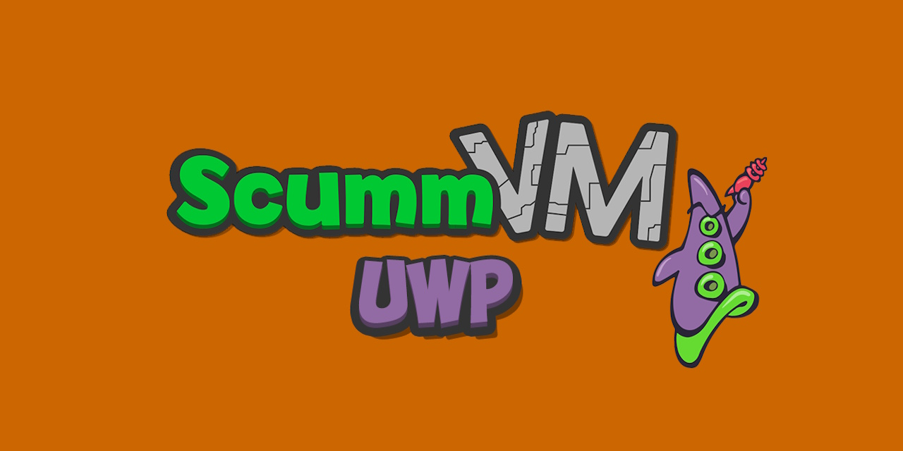
</p>

<p align="center">
  <strong>Adventure games on Windows and Xbox — ScummVM, no RetroArch frontend, no fuss.</strong>
</p>

<p align="center">
  
  
  
  
  
</p>

---

## What is this?

A standalone UWP port of [ScummVM](https://www.scummvm.org/) — the classic
point-and-click adventure engine (Monkey Island, Broken Sword, Discworld, Kyrandia,
Simon the Sorcerer…). Runs natively on **Windows 11** and **Xbox Series (Dev Mode)**.

It bundles the **ScummVM libretro core** (the same binary used in RetroArch) and
hosts it in a hidden **RetroArch UWP shell** that provides rendering, audio, and
input. On top sits a thin **C# launcher** that owns the whole experience: branded
splash, first-run bootstrap (unpacks the data files + themes), config seeding, and
a clean handoff that drops you straight back to the dashboard when you quit.

There is **no RetroArch frontend** in the picture — no RGUI menu, no OSD toasts.
Quitting a game returns you to the console UI. The app even **coexists** with a
regular RetroArch install on the same console (separate package, separate
`scummvm-core:` protocol — it never touches the `retroarch:` one).

---

## Screenshots

<p align="center">
  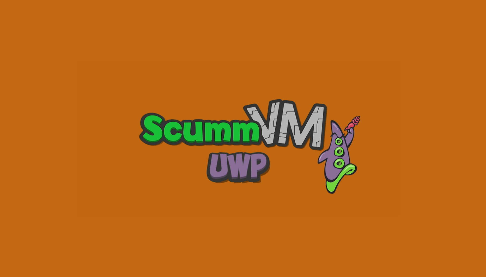
  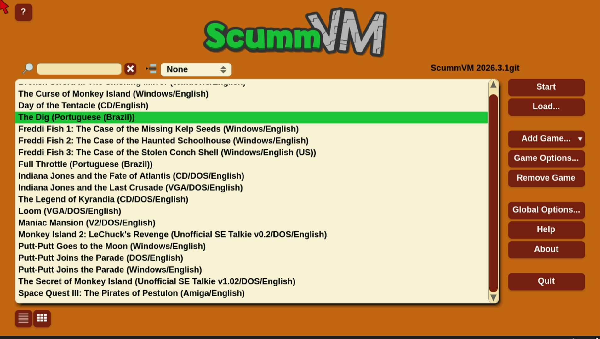
</p>
<p align="center">
  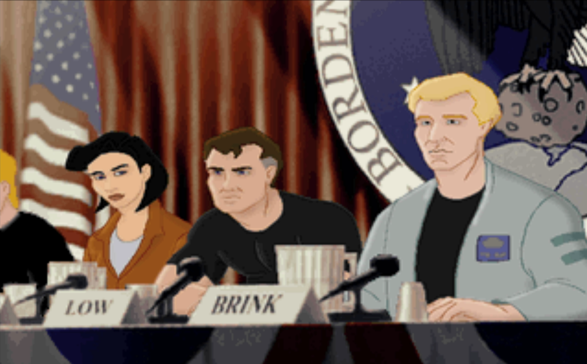
  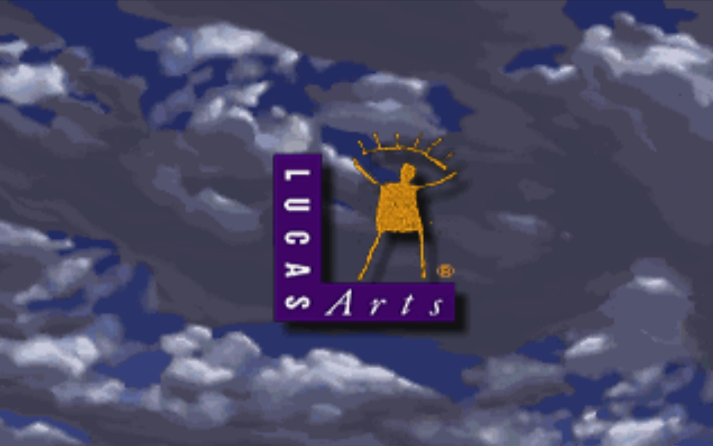
</p>

<details>
  <summary>More screenshots</summary>

<p align="center">
  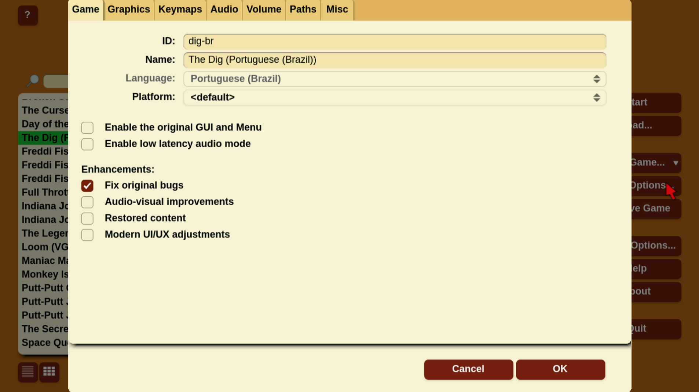
  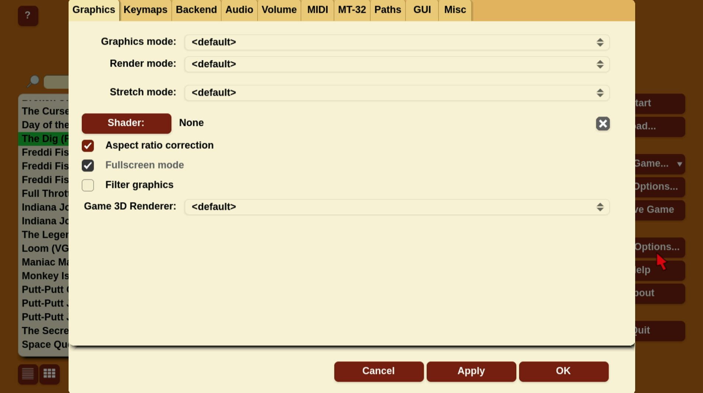
</p>
<p align="center">
  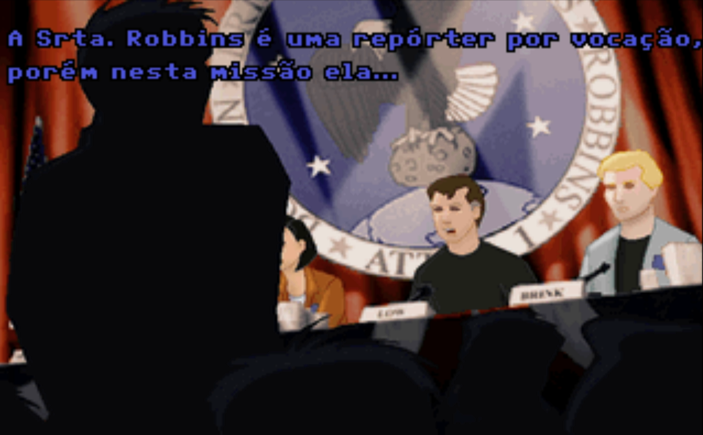
  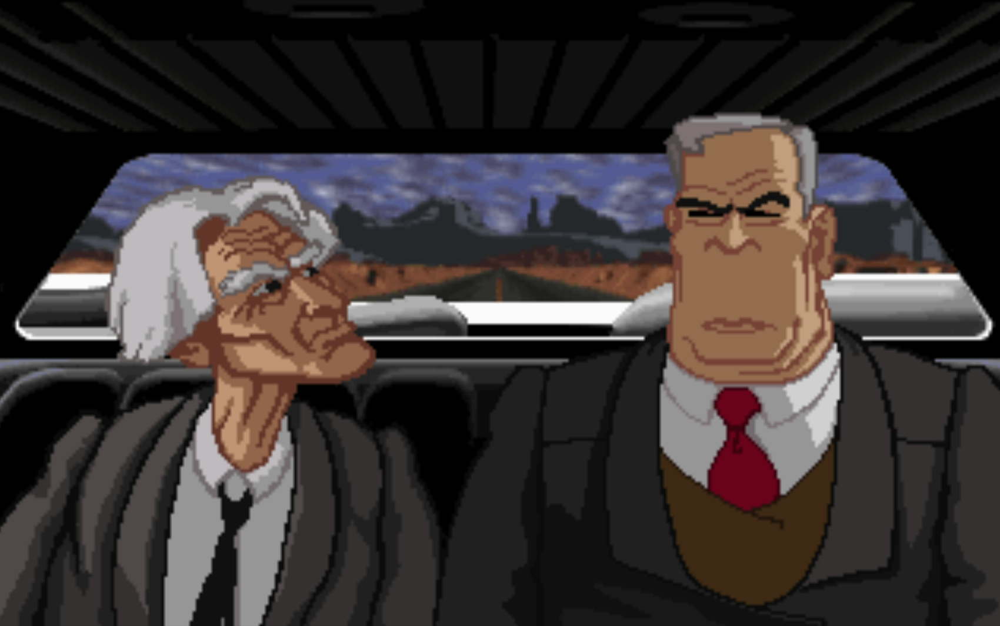
</p>
<p align="center">
  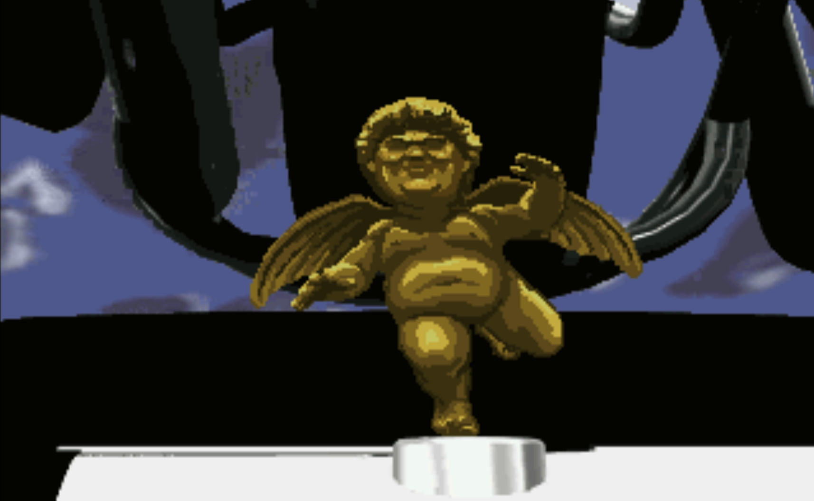
  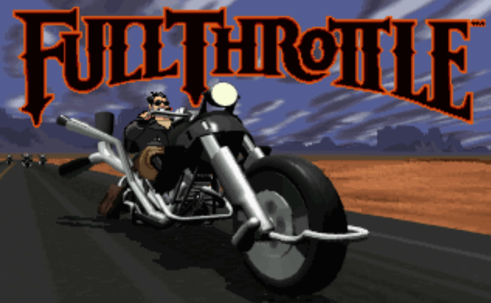
</p>

</details>

---

## Quick Start

### 1. Install

**Windows:**
Download the latest `scummvm-uwp_<version>_x64.zip` from
[Releases](https://github.com/marcelofrau/scummvm-uwp/releases). Extract and run
the `.appx` (sideloading requires Developer Mode enabled in Windows Settings).

**Xbox:**
Enable Developer Mode on your Xbox and either deploy the `.appx` via the
[Xbox Device Portal](https://learn.microsoft.com/en-us/gaming/gdk/_content/gc/features/live/testing-on-xbox-devkits)
or use the deploy script (see [Building from Source](#building-from-source)).

### 2. Add Games

ScummVM ships with its own launcher GUI (the same one from the desktop version),
driven entirely by gamepad or keyboard. On first run it unpacks its data files
into `LocalState\system` automatically.

Games are added by pointing ScummVM at the folder that contains the game files
(e.g. the Monkey Island / Broken Sword CD folder) or a `.scummvm` file that
describes a game. Supported engines include the classic LucasArts SCUMM games,
Sierra AGI/Sierra games, Broken Sword, Discworld, the Kyrandia trilogy, Simon the
Sorcerer, and many more — see the full list on
[ScummVM.org](https://www.scummvm.org/).

### 3. Play

Connect a gamepad or use a USB keyboard + mouse. See [Controls](#controls).

---

## Controls

The shell presents ScummVM through the core's standard RetroPad mapping, so the
launcher and the games are fully navigable with a controller. On the Xbox
controller the RetroPad buttons map as follows:

| Input | ScummVM function |
|-------|------------------|
| **Left Stick / D-Pad** | Move mouse cursor |
| **A** | Space |
| **B** | Enter |
| **X** | F5 (in-game menu) |
| **Y** | Escape |
| **LB** | Left mouse click |
| **RB** | Right mouse click |
| **RT** | Cursor fine control |
| **Select** | Toggle virtual keyboard |
| **Start** | Open ScummVM launcher / GUI |
| **Right Stick** | Arrow keys (↑ ↓ ← →) |
| **LT / L3 / R3** | Unused (no default mapping) |

This is the same mapping the ScummVM libretro core ships upstream — you can
re-bind any of it inside ScummVM (Options → Keymaps). A USB **keyboard** and
**mouse** work as well, with the desktop key bindings (F5 in-game menu,
Ctrl+F5 quick save, etc.). See
[docs/CONTROLS.md](docs/CONTROLS.md) for the full reference, including cursor
behavior options.

---

## Features

| Feature | Status |
|---------|--------|
| ScummVM 2026.3.1 core (libretro buildbot binary) | ✅ Shipped |
| RetroArch UWP shell: video / audio / input / pacing | ✅ Done |
| Thin C# launcher: splash + first-run bootstrap + handoff | ✅ Done |
| Clean quit to dashboard (no RGUI, no OSD toast) | ✅ Done |
| Data files + patched themes bundled (`system/scummvm.zip`, versioned) | ✅ Done |
| Game Options (Misc tab) crash — fixed (theme version skew) | ✅ Done |
| `gui_scale=150`, English UI, orange `#CC6701` branding | ✅ Done |
| Xbox deploy via Device Portal (coexists with RetroArch) | ✅ Done |
| Self-signed packaging + GitHub Releases CI (`v*` tag) | ✅ Done |
| Automatic version sync with the bundled core | ✅ Done |
| FromApp filesystem access (sandbox) | ⏳ Planned |
| Local MSVC core build | ⏳ Optional (patch `0002`) |

---

## Versioning

The app version always mirrors the **shipped core**:

`<ScummVM base>.<build counter>` → e.g. **2026.3.1.7**

- Base comes from `cores/scummvm_libretro.info` (`display_version = "2026.3.1git"`
  → `2026.3.1`), so a core upgrade is always visible in the app version.
- The build counter is bumped on every build (`build_counter.txt`) by
  `tools/version.ps1`, wired as a PreBuildEvent in the launcher project.
- A release is cut by tagging `v2026.3.1.<N>` — the CI builds, packages, and
  publishes it automatically.

See [VERSIONS.md](VERSIONS.md) for the full matrix.

---

## Building from Source

### Prerequisites

- **Visual Studio 2022** Community (found via `vswhere`) with the UWP workload
- **Windows SDK 10.0.26100.0**
- **x64 only** — ARM/ARM64/x86 not supported (Xbox Series is x64)

### Build

```powershell
./scripts/build.ps1 -Configuration Release -Platform x64
```

Restores NuGet packages, then builds `Release\x64`.

### Package (APPX + release zip)

```powershell
./scripts/package.ps1 -Configuration Release -Platform x64
```

Builds (unless `-SkipBuild`), signs the appx with the cert in `certs/`
(`dosbox-uwp.pfx` locally; CI generates its own), and produces:

- `dist\ScummVM.appx`
- `scummvm-uwp_<version>_x64.zip` — the appx + x64 dependencies, ready to share

### Run (Windows)

```powershell
./scripts/run.ps1 -Configuration Release -Platform x64
```

### Deploy (Xbox)

Deploy is **manual** through the Xbox Device Portal (Dev Mode):

1. Open `https://<ip>:11443` in a browser (username/password from Dev Mode).
2. Go to **Apps** → **Add** → upload the `.appx` from `dist\` (or the
   `AppPackages\…_x64_Test\` output).
3. Click **Deploy** and launch the app.

`scripts/deploy-xbox.ps1` was removed — it didn't work. The portal never
uninstalls or upgrades an existing RetroArch install on the console.

### CI/CD

`.github/workflows/release.yml` — triggered by a `v*` tag or manually
(`workflow_dispatch`):

1. Checkout with **recursive submodules + LFS** (the versioned `scummvm.zip`
   lives in LFS).
2. Generate a self-signed cert, build, package (`appx` + deps).
3. Upload artifact and create the GitHub Release with static
   `release_notes.md` body.

---

## Project Structure

```
scummvm-uwp/
├── launcher/ScummVMLauncher/          ← C# UWP launcher (UI, bootstrap, handoff)
│   ├── App.xaml.cs / MainPage.xaml.cs ← handoff, SeedRetroArchConfig, 4s splash floor
│   ├── system/scummvm.zip             ← versioned: datafiles + patched themes (~76 MB, LFS)
│   ├── cores/                         ← scummvm_libretro.dll + .info (dll gitignored)
│   └── Package.appxmanifest           ← two apps: "ScummVM" + hidden "RetroArch"
├── extern/
│   ├── scummvm/                       ← Submodule — clean upstream checkout
│   └── retroarch/                     ← Submodule — XboxEmulationHub fork (shell only)
├── patches/scummvm/                   0001 theme fix (essential), 0002 MSVC build (optional)
├── tools/version.ps1                  ← PreBuildEvent: sync version with the core
├── scripts/                           ← build / package / install / run / deploy / status
├── assets/                            ← Branding sources (splash, tiles, social preview)
├── docs/                              ← Architecture, discoveries, handoff, plans
└── .github/workflows/release.yml      ← CI: build + sign + release on v* tag
```

> `extern/scummvm` and `extern/retroarch` are kept **100% upstream** (no fork).
> Any ScummVM delta lives as a patch in `patches/scummvm/`, and the versioned
> `system/scummvm.zip` already ships the patched themes — regenerate it via the
> workflow in `patches/scummvm/README.md` when updating the core.

---

## For Developers

### How It Works

The app is a **libretro frontend chain** with three actors, joined by two URI
protocols:

1. **Launcher (`ScummVMLauncher.exe`)** — on start it unpacks
   `system/scummvm.zip` into `LocalState\system` (idempotent via the
   `.scummvm-ready` flag), writes a minimal `scummvm.ini`
   (`gui_theme=scummremastered`), seeds `retroarch.cfg`, holds a 4-second
   splash floor, then fires `scummvm-core:` at RetroArch.

2. **Shell (`RetroArch-msvcUWP.exe`)** — hidden app (`AppListEntry="none"`).
   Parses the protocol, runs `rarch_main` with `-L cores\scummvm_libretro.dll`,
   and calls `retro_load_game(NULL)` → ScummVM's own launcher GUI renders
   straight into RetroArch's video output. RetroArch is a dumb renderer here;
   ScummVM owns its entire interface.

3. **Handoff** — quitting ScummVM's GUI → `RETRO_ENVIRONMENT_SHUTDOWN` →
   with `load_dummy_on_core_shutdown=false` RetroArch unloads instead of
   landing in RGUI, then `App::Uninitialize` fires
   `scummvm-launcher:?cmd=exit`, and the launcher calls
   `Application.Current.Exit()` → dashboard. `video_font_enable=false` keeps the
   OSD toast from flashing during shutdown.

### Key Technical Decisions

| Decision | Choice | Why |
|----------|--------|-----|
| Shell | RetroArch UWP (compiled from source, XboxEmulationHub fork) | Proven UWP libretro host: rendering, audio, input, pacing. No RetroArch code changes. |
| Core | Bundled buildbot `scummvm_libretro.dll` | Same binary as RetroArch; no local core build needed to ship |
| Core source | `extern/scummvm` kept clean upstream | Deltas live as patches (`patches/scummvm/`) |
| Video driver | Forced `d3d11` | A stale `gl` driver after a HW core unload crashes the menu on Xbox |
| Dummy core | `load_dummy_on_core_shutdown=false` | Makes quit actually quit instead of opening RGUI |
| OSD | `video_font_enable=false` | No toast flash during shutdown |
| Versioning | Derived from the shipped core's `display_version` | App version always tracks the real ScummVM version |
| Theme fix | Patched themes inside the versioned zip | Newer core registers a `GameOptions_Misc` dialog the older themes lacked (fatal tab crash — fixed) |

### Submodule Policy

- **Never commit to `extern/scummvm` / `extern/retroarch`** — patches go in
  `patches/scummvm/`.
- When the core updates: update the submodule, apply `0001` (and `0002` if
  rebuilding with MSVC), regenerate the themes, **commit the new zip**, revert
  the submodule. Full workflow in `patches/scummvm/README.md`.

### Known Gotchas

| Issue | Detail |
|-------|--------|
| Version skew | The buildbot core can be ahead of the theme sources — patch `0001` fixes `GameOptions_Misc`; regenerate `scummvm.zip` on every core update |
| Restore required | Deleting `obj/` without a `/t:Restore` first breaks with WMC1006 — always use `scripts/build.ps1` |
| LFS | `system/scummvm.zip` (~76 MB) is LFS-tracked; CI uses `lfs: true` |
| DLL over limit | `scummvm_libretro.dll` (~124 MB) exceeds GitHub's 100 MB file limit — gitignored, re-download from the buildbot |
| Version downgrade | UWP refuses to install a package with a lower version than the installed one — always bump the counter |
| Coexistence | Never register/override the `retroarch:` protocol or touch the user's real RetroArch package |

---

## Documentation

| Document | Description |
|----------|-------------|
| [Architecture](docs/ARCHITECTURE.md) | Current shipped architecture: components, protocols, bootstrap, quit flow, build/deploy |
| [Versions](VERSIONS.md) | Version matrix and how the version is computed |
| [Discoveries](docs/DISCOVERIES.md) | Chronological log of every problem found and fixed (16 entries) |
| [Handoff](docs/HANDOFF.md) | Project state for the next agent/session |
| [Port Plan](docs/PORT-PLAN.md) | Design history and the Route C decision |
| [Filesystem](docs/FILESYSTEM.md) | UWP sandbox FS strategy (FromApp API) |
| [Controls](docs/CONTROLS.md) | Full controller / keyboard / mouse reference for the ScummVM core |
| [Patch Workflow](patches/scummvm/README.md) | Theme patches + zip regeneration workflow |

---

## Dependencies & Credits

| Project | Role | License |
|---------|------|---------|
| [ScummVM](https://github.com/scummvm/scummvm) | The adventure game engine itself. Shipped as the libretro buildbot binary + included as submodule at `extern/scummvm`. | GPL-3.0 |
| [RetroArch UWP (XboxEmulationHub fork)](https://github.com/XboxEmulationHub/RetroArch) | UWP shell: rendering, audio, input, frame pacing. Hidden app, no frontend UI. Submodule at `extern/retroarch`. | GPL-3.0 |
| [dosbox-uwp](https://github.com/marcelofrau/dosbox-uwp) | Reference UWP libretro shell + deploy tooling this repo was modeled on | GPL-2.0 |
| [Numix icon theme](https://github.com/numixproject/numix-icon-theme) | Launcher UI icons | GPL-3.0 |

---

## License

**GPL-3.0** — same as ScummVM. See [`LICENSE`](LICENSE) for the full text.

- ScummVM core: [GPL-3.0](https://github.com/scummvm/scummvm)
- RetroArch shell: [XboxEmulationHub/RetroArch](https://github.com/XboxEmulationHub/RetroArch) (GPL-3.0)
- Launcher icons: [Numix icon theme](https://github.com/numixproject/numix-icon-theme) (GPL-3.0)
- Shell base: [dosbox-uwp](https://github.com/marcelofrau/dosbox-uwp) (GPL-2.0)
