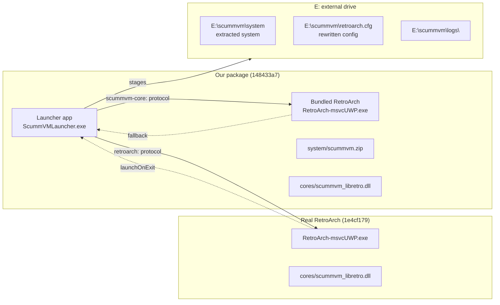
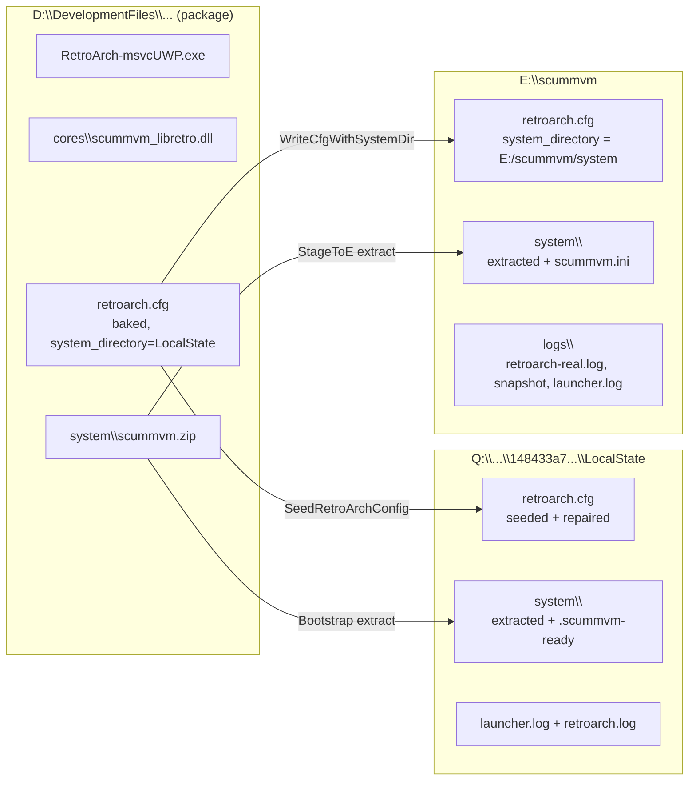
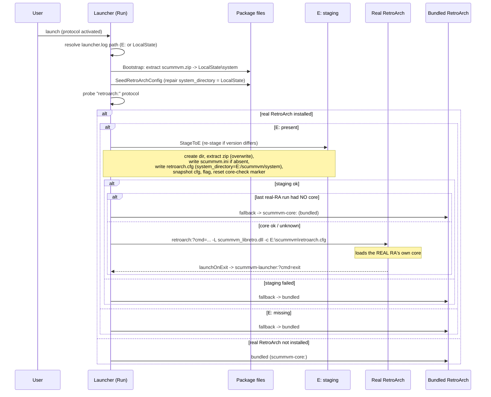
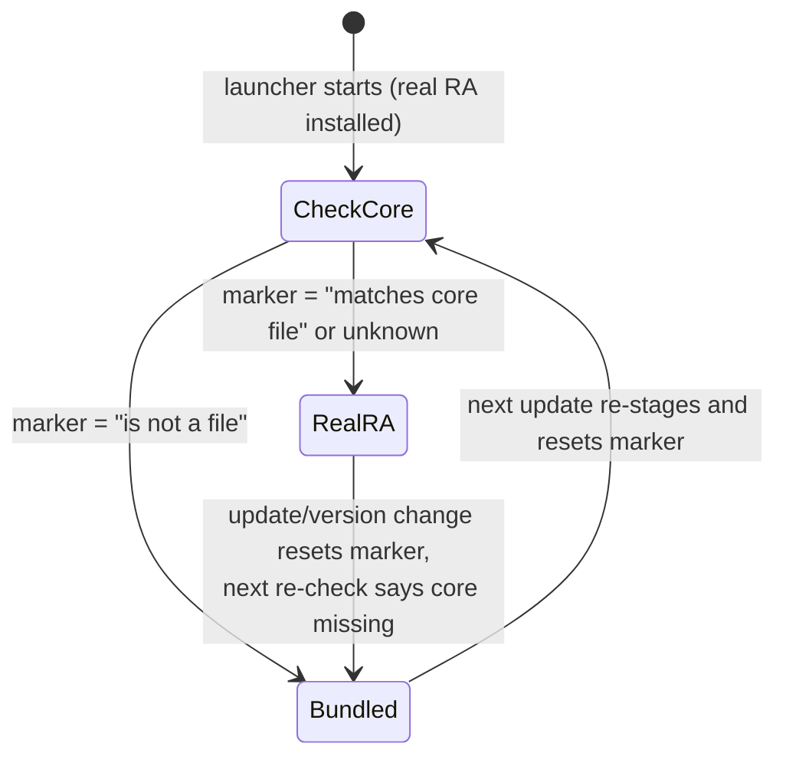
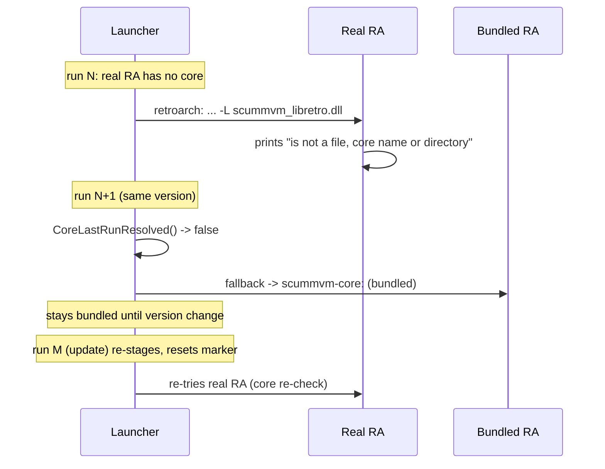

# ScummVM UWP Launcher — Architecture

This document describes how the ScummVM launcher for Xbox works end-to-end:
what ships in the package, how the launch flow decides between the user's real
RetroArch and the bundled one, how the E: staging drive is populated, how the
RetroArch config is rewritten, and how the "core missing" fallback works.

---

## 1. Components and packages

| Component | Package family | Role |
|---|---|---|
| **ScummVM Launcher** | `148433a7-fd05-4815-9e57-fa81cb66d285_atgxky5qxrpe0` | Full-screen XAML app that detects RetroArch, stages E:, picks the launch path, then exits. |
| **Bundled RetroArch** | same package (second app entry) | A RetroArch `1.22.2` build shipped inside the launcher package, used as fallback. |
| **Real RetroArch** | `1e4cf179-f3c2-404f-b9f3-cb2070a5aad8` (Store, `8ngdn9a6dx1ma`) | The user's own RetroArch (Store app under `S:\Program Files\WindowsApps\...\cores\`). **Never modified.** |

The launcher and the bundled RetroArch live in the **same package**. The real
RetroArch is a separate package and is treated as untouchable: the project rule
is to coexist with it, never uninstall, update or write into it.



---

## 2. Protocols

| Scheme | Handler | Purpose |
|---|---|---|
| `scummvm-launcher:` | Our launcher (App entry) | Re-activates the launcher (e.g. `launchOnExit`) |
| `scummvm-core:` | Our bundled RetroArch | Starts the bundled RetroArch directly |
| `retroarch:` | **Only** the real RetroArch | Starts the real RetroArch with a CLI string |

Our package does **not** register `retroarch:`, so probing it is a reliable way
to test whether the real RetroArch is installed — there is no handler conflict.

The protocol payload is a RetroArch command line:

```
retroarch:?cmd=<RetroArch CLI arguments>&launchOnExit=<scheme URI>
```

`<cmd>` is tokenized by the RA UWP frontend with `std::quoted` (escape char
`NULL`, so backslashes are preserved) and becomes the `argv` for `rarch_main`.
`launchOnExit` is fired when RetroArch exits.

---

## 3. Drives and file layout

| Location | Contents |
|---|---|
| `D:\DevelopmentFiles\148433a7...VS.Debug_x64.marcelo\` | Package install (dev deploy): `RetroArch-msvcUWP.exe`, `cores\scummvm_libretro.dll`, `system\scummvm.zip`, `retroarch.cfg` (baked) |
| `Q:\Users\UserMgr2\AppData\Local\Packages\148433a7...\LocalState\` | Our LocalState: `retroarch.cfg` (seeded), `system\` (extracted, flag), `launcher.log`, `retroarch.log` |
| `E:\scummvm\` | Staging drive: `retroarch.cfg`, `system\`, `logs\` |
| `E:\scummvm\system\` | Extracted `scummvm.zip` (210 files, ~89 MB) + `scummvm.ini` + `.scummvm-ready` flag |
| `E:\scummvm\logs\` | `retroarch-real.log`, `retroarch.cfg` snapshot, `launcher.log` (when E: present) |



All logs are written to `E:\scummvm\logs\` when the E: drive is present and
writable; otherwise they fall back to LocalState. `launcher.log` is resolved at
startup, not copied.

---

## 4. Startup flow



### Decision points (in `MainPage.xaml.cs`)

1. **`IsRealRetroArchInstalled()`** — probes `retroarch:` via
   `Launcher.QueryUriSupportAsync`. `Available` means the real RetroArch is
   registered (our package does not register that scheme).
2. **`StageToE(version)`** — runs only when E: is present and the app version
   differs from the `.scummvm-ready` flag. Re-runs the whole staging so every
   update re-writes the E: system + config.
3. **`CoreLastRunResolved()`** — reads `E:\scummvm\logs\retroarch-real.log` and
   checks the marker the real RetroArch printed on its previous run:
   * `matches core file` → core present → launch real RA.
   * `is not a file, core name or directory` → core missing → bundled.
   * no log / neither marker → unknown → assume real RA.

---

## 5. Staging to E:

`StageToE` is idempotent and safe:

* Refuses to run if `E:\scummvm\system` is a reparse point / junction (safety).
* Creates `E:\scummvm\system` recursively.
* Extracts `scummvm.zip` with **overwrite** (`CREATE_ALWAYS`) — no destructive
  delete step, so user content outside the zip is never touched.
* Writes `scummvm.ini` only if it does **not** already exist (preserves the
  user's ScummVM settings across re-stages); the rest is always refreshed.
* Rewrites `E:\scummvm\retroarch.cfg` so that `system_directory = "E:/scummvm/system"`
  and snapshots it to `E:\scummvm\logs\retroarch.cfg`.
* Writes `.scummvm-ready` = current version.
* **Resets the core-check marker** on version change so the next run re-checks
  the real RetroArch's core (see §6).

### Why `system_directory` (and not `libretro_system_directory`)

RetroArch's config key for the core system directory is `system_directory`
(`configuration.c`: `SETTING_PATH("system_directory", ...directory_system...)`).
An older revision of the code appended `libretro_system_directory`, a key RA
does not read, so the real RetroArch kept using the value baked into the bundled
config (`Q:/.../148433a7.../LocalState/system`) and the ScummVM skin never
loaded. Both the staging path and the LocalState seed now rewrite
`system_directory`.

---

## 6. Core-missing detection and fallback

### The constraint

The real RetroArch is a Store app. Its cores live under
`S:\Program Files\WindowsApps\1e4cf179...\cores\`, which is ACL-restricted — the
launcher (an AppContainer process) cannot enumerate it even with
`broadFileSystemAccess`. There is also no reliable way to poll the real
RetroArch while it is foreground: the launcher is suspended the moment it hands
off focus, so any in-run watchdog stops executing.

### The mechanism

The only observable signal is what the real RetroArch prints when it resolves
the `-L` argument during startup (its log is redirected to
`E:\scummvm\logs\retroarch-real.log` with `--log-file`):

* `--libretro argument "scummvm_libretro.dll" matches core file "S:\..."` → core present.
* `--libretro argument "scummvm_libretro.dll" is not a file, core name or directory. Ignoring.` → core missing.

The launcher reads this log on the **next** startup, so detection is **one run
behind**: the first time the real RetroArch lacks the core, the user lands in
its menu once. On the following launch the marker is seen and the launcher goes
straight to the bundled RetroArch.

### State transitions



* **Version change** (re-stage) resets the marker, so the core is re-checked on
  the next run.
* After the fallback triggers, the launcher **keeps using the bundled
  RetroArch** until the marker is reset by a version change — the real RA is not
  re-tried mid-version, because a missing core cannot magically appear without a
  re-install/update.



---

## 7. Launch URIs

**Real RetroArch** (preferred):

```
retroarch:?cmd=retroarch -v --log-file=E:/scummvm/logs/retroarch-real.log -L scummvm_libretro.dll -c E:\scummvm\retroarch.cfg&launchOnExit=scummvm-launcher:?cmd=exit
```

* `-L scummvm_libretro.dll` — the **real RA's own** core, resolved from its
  cores directory.
* `-c E:\scummvm\retroarch.cfg` — our config with
  `system_directory = E:/scummvm/system`.
* `--log-file=E:/scummvm/logs/retroarch-real.log` — separate log used for core
  resolution detection.
* `launchOnExit` returns to the launcher when RA exits.

**Bundled RetroArch** (fallback):

```
scummvm-core:?cmd=retroarch -v --log-file=<E: or LocalState>/retroarch.log -L cores\scummvm_libretro.dll&launchOnExit=scummvm-launcher:?cmd=exit
```

`-L cores\scummvm_libretro.dll` is relative to our package install dir.

Both are retried up to 4 times (`LaunchWithRetry`) with a short backoff, after
which the launcher exits.

---

## 8. Logging

| File | Written by | Rotated | Path |
|---|---|---|---|
| `launcher.log` | launcher | yes (3) | `E:\scummvm\logs\` when E: present, else LocalState |
| `retroarch.log` | bundled RA | yes (3) | `E:\scummvm\logs\` when E: present, else LocalState |
| `retroarch-real.log` | real RA (`--log-file`) | yes (3) | `E:\scummvm\logs\` (only when staging ran) |
| `retroarch.cfg` snapshot | launcher (staging) | — | `E:\scummvm\logs\` |

The real RA logs with `-v`; the bundled config also sets
`frontend_log_level = "0"` and `log_level = "0"` for maximum verbosity.
`OutputDebugStringA` output ends each line with a newline so debug viewers split
lines correctly.

---

## 9. State flags

| File | Meaning |
|---|---|
| `E:\scummvm\system\.scummvm-ready` | Version that staged E: — triggers re-stage when it differs |
| `E:\scummvm\logs\retroarch-real.log` | Holds the core-resolution marker from the last real RA run |
