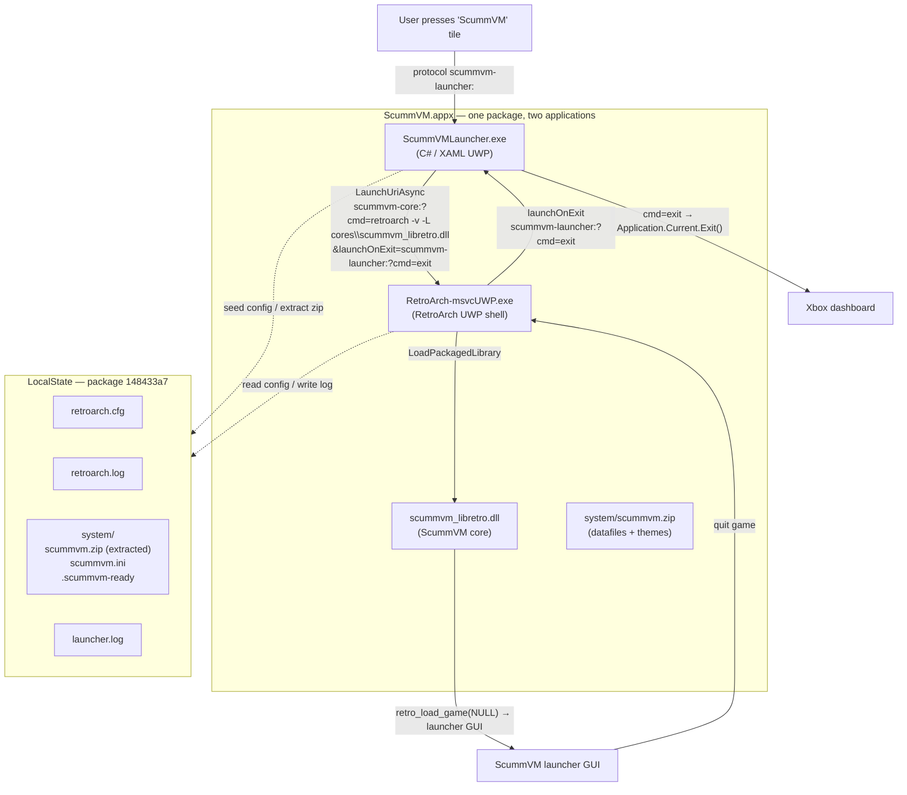
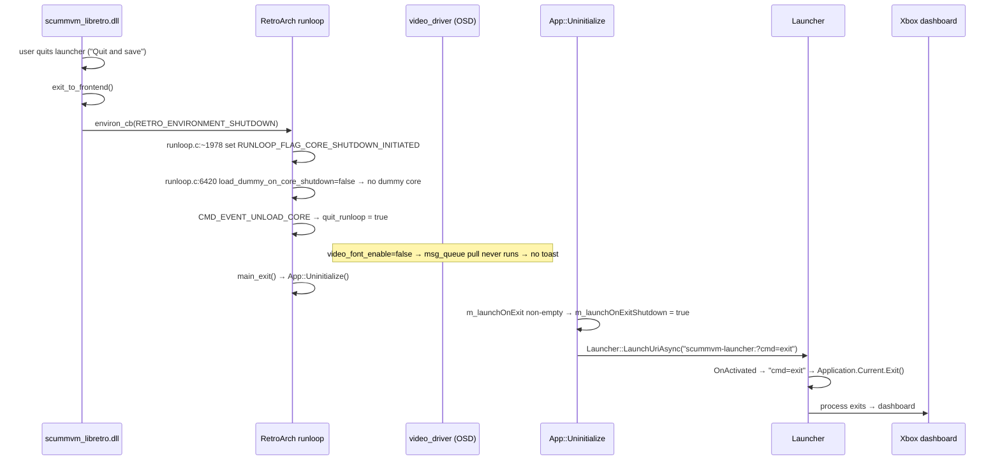

# ScummVM UWP — Architecture

Status: **active**. Last updated: 2026-08-07.

This document describes the current, shipped architecture of the ScummVM UWP
port (Xbox / Windows Universal). Read `PORT-PLAN.md` for the design history and
`FILESYSTEM.md` for the sandbox file-access strategy.

## 1. Big picture

ScummVM runs as a **libretro core** hosted by **RetroArch UWP** (compiled from
source, XboxEmulationHub fork). RetroArch is used purely as the shell
(rendering, audio, input, frame pacing). A thin C# **launcher app** drives the
whole UX: splash screen, first-run bootstrap, RetroArch config seeding, and the
process handoff that returns the console to the dashboard when the user quits a
game.

One appx package contains **two UWP applications** plus the core:

```
ScummVM.appx (package Identity Name = 148433a7-fd05-4815-9e57-fa81cb66d285)
│
├── ScummVMLauncher.exe      Application Id="App"        — visible tile "ScummVM"
│                                                          registers protocol `scummvm-launcher`
│
├── RetroArch-msvcUWP.exe    Application Id="RetroArch"  — hidden (AppListEntry="none")
│                                                          registers protocol `scummvm-core`
│
├── cores/
│   ├── scummvm_libretro.dll     the ScummVM core (built from extern/scummvm)
│   └── scummvm_libretro.info
│
├── system/
│   └── scummvm.zip              ScummVM datafiles + themes (extracted at first run)
│
└── Assets/                     logos, tiles, splash images
```

Both applications share the package's `LocalState` (per-package, scoped to
`148433a7…`). RetroArch is hidden from the app list because the only public
entry point is the "ScummVM" tile.

## 2. Component diagram



## 3. The two protocols

The handoff between launcher and RetroArch is entirely **protocol-based** — no
shared process, no foreground activation tricks.

| Protocol | Registered on | Purpose |
|---|---|---|
| `scummvm-core:` | RetroArch app | Launch RetroArch with a RetroArch command line |
| `scummvm-launcher:` | Launcher app | Wake the launcher (or just tell it to exit) |

### 3.1 `scummvm-core:` → RetroArch

URI format (parsed in `extern/retroarch/uwp/uwp_main.cpp` →
`App::ParseProtocolArgs`, line ~745):

```
scummvm-core:?cmd=<RetroArch CLI args>&launchOnExit=<uri to launch when RA exits>
```

`cmd` is tokenized with `std::quoted(s, '"', (char)0)` (line ~782) so quoted
paths keep their backslashes. `launchOnExit` is stored on the `App` singleton;
`forceExit` quits RetroArch immediately.

Example used by the launcher:

```
scummvm-core:?cmd=retroarch -v --log-file=<LocalState>/retroarch.log -L cores\scummvm_libretro.dll
           &launchOnExit=scummvm-launcher:?cmd=exit
```

### 3.2 `scummvm-launcher:` → launcher

`App.OnActivated` (`launcher/ScummVMLauncher/App.xaml.cs`) checks for
`cmd=exit` in the query: if present, it calls `Application.Current.Exit()`
immediately and does **not** render the UI. Any other activation renders the
splash page and runs the bootstrap.

## 4. Launch flow (bootstrap)

`MainPage.Run()` (`launcher/ScummVMLauncher/MainPage.xaml.cs`) is the whole
orchestration:

```mermaid
sequenceDiagram
    participant T as Tile / protocol
    participant L as Launcher (C#)
    participant S as LocalState
    participant RA as RetroArch UWP
    participant C as scummvm_libretro.dll

    T->>L: activate (scummvm-launcher:)
    L->>L: Log "=== ScummVM launcher started ==="
    L->>L: spawn Task.Run(Bootstrap)
    L->>S: extract system/scummvm.zip → system/  (if no .scummvm-ready)
    L->>S: write system/scummvm.ini (gui_theme=scummremastered)
    L->>S: write .scummvm-ready flag
    L-->>L: hold until ≥ 4 s total elapsed (masks boot latency)
    L->>S: SeedRetroArchConfig() — force d3d11 / no-dummy / no-font
    L->>L: IsRealRetroArchInstalled()? (PackageManager, family 1e4cf179-…)
    alt real RetroArch installed
        L->>RA: LaunchUriAsync("retroarch:?cmd=retroarch -v -L cores\\scummvm_libretro.dll&launchOnExit=scummvm-launcher:?cmd=exit")
        RA->>C: retro_load_game(NULL)  (core must be installed inside RA)
        Note over L: success = RetroArch process alive (no log access)
    else bundled shell
        L->>RA: LaunchUriAsync("scummvm-core:?cmd=retroarch -v ...&launchOnExit=scummvm-launcher:?cmd=exit")
        RA->>RA: ParseProtocolArgs → rarch_main(argc, argv)
        RA->>C: retro_load_game(NULL)
        C-->>RA: ScummVM launcher GUI (rendered via video_cb)
        L->>L: poll retroarch.log (≤ 10 s)
    end
    L->>L: on success → Application.Current.Exit()
    Note over L: launcher now dead; RetroArch is foreground
```

If the real-RetroArch handoff fails all retries (e.g. the core isn't installed
inside it), the launcher **falls back** to the bundled `scummvm-core:` path
before giving up.

### 4.1 Bootstrap details

- Extraction target: `LocalState\system`. The `.scummvm-ready` flag makes
  extraction **idempotent** — subsequent runs skip it.
- A minimal `scummvm.ini` is written with `gui_theme=scummremastered`.
- The **4-second floor** (`if (elapsed < 4s) delay(...)`) keeps the branded
  splash on screen while the slow part (dezip + DLL load) happens behind it;
  it runs on a background thread so the UI thread stays responsive.
- If extraction throws, the splash shows "Preparation failed" and the process
  stops — never hands off to a broken install.

### 4.2 `SeedRetroArchConfig` — the three guaranteed keys

On every launch the launcher ensures `LocalState\retroarch.cfg` contains:

| Key | Value | Why |
|---|---|---|
| `video_driver` | `"d3d11"` | RetroArch on Xbox must use D3D11 for the menu. RA can persist `"gl"` (save-on-suspend while a GL/HW core was active); a stale `gl` driver after core unload crashes the menu (null call). |
| `load_dummy_on_core_shutdown` | `"false"` | When a core requests shutdown, RA by default loads the **dummy core** and lands in the RGUI menu instead of exiting. `false` makes shutdown complete (see §5). |
| `video_font_enable` | `"false"` | Disables the OSD message queue pull, so no toast is drawn during shutdown (see §5). |

Behavior: existing keys are rewritten only if their value differs; missing keys
are appended. On first run the whole config is generated (with
`menu_driver=rgui`, `log_to_file=true`, `log_dir`/`system_directory` pointed at
`LocalState`).

## 5. Quit flow — returning to the dashboard

This is the flow that was the hardest to get right (see
`docs/DISCOVERIES.md`). Two RetroArch behaviors fight a clean exit; both are
disabled by config.



The key mechanics, with file references:

1. **Core asks to stop.** Quitting ScummVM's launcher GUI calls
   `exit_to_frontend()` → `environ_cb(RETRO_ENVIRONMENT_SHUTDOWN, NULL)`
   (`extern/scummvm/backends/platform/libretro/src/libretro-core.cpp:697`).
2. **RetroArch sees the shutdown request.** `runloop.c:~1978` sets
   `RUNLOOP_FLAG_CORE_SHUTDOWN_INITIATED | RUNLOOP_FLAG_SHUTDOWN_INITIATED`.
3. **Dummy-core trap.** In the main loop (`runloop.c:6420`) RA checks
   `load_dummy_on_core_shutdown`. If `true` (the desktop default, and what RA
   persists into `retroarch.cfg`), it loads the dummy core and **clears
   `RUNLOOP_FLAG_SHUTDOWN_INITIATED`** (`runloop.c:6429-6433`) — i.e. shutdown
   is aborted and the RGUI menu opens. With `false`, it unloads the core and
   sets `quit_runloop = true` (`runloop.c:6437-6444`) — the loop exits.
4. **OSD toast trap.** On exit RetroArch would normally draw the queued OSD
   message ("Shutting down" / core message). The pull is gated on
   `video_info.font_enable` (`extern/retroarch/gfx/video_driver.c:5211`); with
   `video_font_enable=false` the queue is never drained, so no toast flashes.
5. **Handoff.** `main_exit` → `App::Uninitialize()`
   (`extern/retroarch/uwp/uwp_main.cpp:376`). Because `m_launchOnExit` is set,
   it launches `scummvm-launcher:?cmd=exit`. RA marks
   `m_launchOnExitShutdown=true` and shuts itself down in
   `OnEnteredBackground` (without that flag RA does not exit cleanly).
6. **Exit.** The launcher's `OnActivated` matches `cmd=exit`, calls
   `Application.Current.Exit()` without showing UI, and the console returns to
   the dashboard.

## 6. The ScummVM core

- The shipped `cores/scummvm_libretro.dll` is a **buildbot binary**
  (ScummVM 2026.3.1git), **not** built locally. The `extern/scummvm` submodule
  is kept as a **clean upstream checkout**; any local delta lives as a patch
  in `patches/scummvm/` (see `patches/scummvm/README.md`).
- **Version-skew trap (fixed, see `docs/DISCOVERIES.md` ## 15):** the core
  binary is newer than the theme sources at the submodule HEAD. The binary
  registers a `GameOptions_Misc` dialog that the older themes never defined —
  opening the Misc tab of Game Options was fatal. The fix is applied to the
  **themes inside the versioned `system/scummvm.zip`**; the patch is captured
  in `patches/scummvm/0001-gameoptions-misc-theme.patch` for regeneration.
- Started with **no game content**: `retro_load_game(NULL)` →
  `scummvm_main("scummvm")` → the ScummVM launcher GUI is ScummVM's own GUI,
  rendered directly into RetroArch's video output. RetroArch is a dumb
  renderer here; ScummVM owns its full interface.
- Runs its emulation/GUI on a dedicated emu thread
  (`retro_run` → `LIBRETRO_G_SYSTEM`); `retro_unload_game`/`retro_reset`
  coordinate `close_emu_thread()`.
- Core data lives in `LocalState\system` (pointed at by
  `system_directory` in `retroarch.cfg`).

### 6.1 `system/scummvm.zip` is versioned

`launcher/ScummVMLauncher/system/scummvm.zip` (~76 MB) is **committed to git**.
It bundles ScummVM's datafiles **and the patched themes** (## 6). It is under
GitHub's 100 MB per-file limit. `cores/scummvm_libretro.dll` (~124 MB) stays
gitignored — over the limit and re-downloadable.

When updating the core, the zip must be **rebuilt with the theme patch applied
and committed again** (workflow in `patches/scummvm/README.md`).

## 7. Filesystem access (sandbox)

The ScummVM core currently uses plain Win32 file calls, which UWP blocks. The
planned fix is the **FromApp API family** (`fileapifromapp.h`); the manifest
already declares `broadFileSystemAccess` (rescap). See `docs/FILESYSTEM.md`.
Note: the shipped manifest keeps `MinVersion="10.0.15063.0"`; if/when the
FromApp patch lands, `MinVersion` must be bumped to `10.0.17763.0`.

## 8. Branding & visuals

The launcher and native splash share one orange identity to make the boot
sequence seamless (no white flash — see `docs/DISCOVERIES.md`):

| Element | Value |
|---|---|
| Launcher page background | `#CC6701` |
| Native UWP splash background (`uap:SplashScreen BackgroundColor`) | `#CC6701` — **both** applications |
| Status text foreground | `#241303` |
| Launcher UI image | `Assets/splash-1920x1080.png` (`Stretch="Uniform"`) |
| Native splash image | `Assets/SplashScreen.scale-200.png` (kept; only the background color changed) |

Because the native splash bitmap is size-locked to its scale (`.scale-200` =
1240×600), the launcher uses a separate full-HD image for its own page.

## 9. Capabilities

`internetClient`, `internetClientServer`, `privateNetworkClientServer`,
`runFullTrust` (rescap), `broadFileSystemAccess` (rescap), `expandedResources`
(rescap).

## 10. Build, package, deploy

All scripts live in `scripts/`:

| Script | What it does |
|---|---|
| `build.ps1` | Finds MSBuild (vswhere), runs `/t:Restore` then builds `Release\x64`. Restore before build is required (deleting `obj/` without restore breaks with WMC1006). The launcher's PreBuildEvent runs `tools/version.ps1` (bumps the build counter). |
| `clean.ps1` | `msbuild /t:Clean` + deletes `AppPackages`, `bin`, `obj`. |
| `rebuild.ps1` | `clean.ps1` + `build.ps1`. |
| `package.ps1` | Builds (unless `-SkipBuild`), signs with `signtool` (`-PfxPath`, default `certs/dosbox-uwp.pfx`, password `dev`), copies to `dist\ScummVM.appx` and builds the release zip `scummvm-uwp_<ver>_x64.zip` (appx + `Dependencies\x64`). |
| `version.ps1` (`tools/`) | PreBuildEvent: reads `display_version` from `cores/scummvm_libretro.info`, increments `build_counter.txt`, rewrites `Package.appxmanifest` + `version.txt`. Run manually with `-DontIncrement` to just normalize. |
| `install.ps1` | `Add-AppxPackage` locally (Windows) with optional VCLibs deps. |
| `run.ps1` | `install.ps1` + `Start-Process 'scummvm-launcher:'`. |
| `deploy-xbox.ps1` | **Removed** (didn't work). Xbox deploy is manual via Device Portal (see §10.1). |
| `status.ps1` | Git status, submodules, version, appx signature/state. |

The appx is ~190 MB and contains 133 entries: the two EXEs, the RetroArch
runtime DLL set (Qt5*, SDL2, ANGLE/libGLESv2, ffmpeg/avcodec, etc. — shipped by
the RA build), `cores/scummvm_libretro.dll` + `.info`, `system/scummvm.zip`,
and `Assets/`.

### 10.1 Xbox deploy (WDP)

Deploy is **manual** through the Xbox Device Portal. The removed
`deploy-xbox.ps1` used to talk to it as follows — the API reference stays
relevant for portal-side scripting:

1. Endpoint `https://<ip>:11443`, `Authorization: Basic base64(user:pass)`.
2. CSRF dance: first `GET /api/os/info` returns `Set-Cookie: CSRF-Token=…`;
   every POST/DELETE sends `X-CSRF-Token: <token>` + the cookie jar.
3. Lists packages via `GET /api/app/packagemanager/packages` — the field is
   **`InstalledPackages`** (not `Packages`).
4. Installs via `POST /api/app/packagemanager/package?package=<file>` with
   `-F "package=@file"` (multipart). Returns 202.
5. Launches via `POST /api/taskmanager/app` with
   `{ AppId: "App", PackageFamilyName: <pkg> }` (JSON).
6. **Coexistence rule:** the user has a real RetroArch install
   (`1e4cf179-…`). Deploy only *reports* it — it never uninstalls,
   upgrades, or touches it. The launcher may *use* it when present (see §4:
   it hands off via the standard `retroarch:` protocol; the ScummVM core must
   be installed inside that RetroArch). It never registers or overrides the
   `retroarch:` protocol itself.

### 10.2 Versioning & CI/CD

**Scheme:** `<ScummVM base>.<build counter>` → `2026.3.1.<N>` (see
`VERSIONS.md`). The base always derives from the **shipped** core, so a core
upgrade is visible in the app version.

- Source of truth: `cores/scummvm_libretro.info` → `display_version`
  (`"2026.3.1git"` → base `2026.3.1`, stripping the `git` suffix).
- `tools/version.ps1` (PreBuildEvent) increments `build_counter.txt` and
  rewrites both `Package.appxmanifest` (`<Identity Version="…"/>`) and
  `version.txt`.
- Releases are cut by tagging `v2026.3.1.<N>`.

**CI (` .github/workflows/release.yml`)** — triggered on `v*` tags or
`workflow_dispatch`:

1. `actions/checkout@v4` with `submodules: recursive`, `fetch-depth: 0`, and
   **`lfs: true`** (the versioned `system/scummvm.zip` is LFS-tracked — a
   checkout without LFS yields a 133-byte pointer and the build would ship a
   broken zip).
2. Generates a **fresh self-signed cert** (`CN=ScummVM UWP CI`, exported to
   `certs/scummvm-uwp.pfx`) — Xbox Developer Mode does not require installing
   the cert, so no certificate is shipped in the release zip.
3. `scripts/build.ps1` (bumps version via PreBuildEvent) → `scripts/package.ps1
   -SkipBuild -PfxPath certs\scummvm-uwp.pfx` signs the appx and builds the zip
   (`appx` + x64 dependencies only).
4. Uploads the artifact and creates the GitHub Release (name `ScummVM UWP
   <ver>`, tag `v<ver>`, static `release_notes.md` body).

The release zip intentionally contains **only** the appx + dependencies — no
`Install.ps1`, no `.cer` (Dev Mode sideloading doesn't need them).

## 11. Debugging / observability

- Launcher logs: `OutputDebugStringA` + append to `LocalState\launcher.log`.
- Bundled-shell logs: launched with `-v --log-file=<LocalState>/retroarch.log`
  (log_dir/log_to_file also set in the seeded config).
- The launcher polls for `retroarch.log` after the bundled handoff as a
  liveness check before exiting. For the real-RetroArch handoff (whose log
  lives in RetroArch's own sandbox, unreadable from here) the liveness check
  is instead "RetroArch process is alive".
